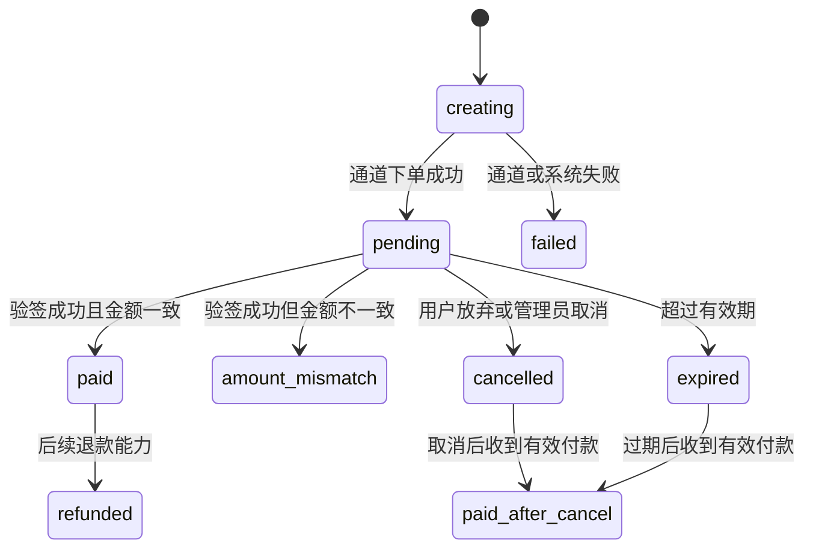

# 云维收款系统 PRD

> 文档版本：V1.1  
> 编写日期：2026-07-18  
> 当前项目：易支付聚合收款页  
> 当前域名：`https://pay1.yunvix.com/`  
> 文档状态：已完成易支付 V1/V2 能力复用评审

## 1. 文档目的

本文档用于把当前“用户输入金额、选择支付方式、生成二维码、轮询支付结果”的简单收款页，升级为一套可稳定运营、可查询、可通知、可审计，并支持第三方开发者通过 API 发起收款的支付系统。

本期重点解决：

1. 网络卡顿、二维码加载失败或用户刷新页面后，订单不能丢失。
2. 用户金额输入错误时，可以放弃当前订单并重新创建。
3. 支付成功页面展示经过验签的实际回调金额，而不是前端输入金额。
4. 商户能够知道什么时间、通过什么方式、实际收到了多少钱。
5. 本地运营台能够查看本系统订单映射、回调、异常和通知；全量上游订单、余额、结算和退款能力优先复用易支付。
6. 第三方开发者能够通过签名 API 创建固定金额订单，再跳转到本系统收银台。
7. 支付成功后，同时向付款用户展示结果，并可靠通知开发者服务器。

## 2. 重构前遗留系统基线

### 2.1 已迁移的旧支付流程

1. 用户在 `index.html` 输入金额并选择支付宝或微信支付。
2. `assets/app.js` 请求 `payapi/create-order.php`。
3. `create-order.php` 调用易支付 `mapi.php` 创建订单。
4. 易支付返回二维码内容或支付链接。
5. 系统将订单保存为 `payapi/orders/{out_trade_no}.json`。
6. 前端每 3 秒请求 `payapi/order-status.php` 查询状态。
7. 易支付异步通知 `payapi/notify.php`，服务端验签后把订单标记为 `paid`。
8. 前端轮询到支付成功后跳转 `success.html`。

### 2.2 已迁移并复用的能力

- 已有易支付下单接口调用逻辑。
- 已有 MD5 参数排序签名和回调验签逻辑。
- 已有异步通知入口和同步返回入口。
- 已有前端二维码展示和订单状态轮询。
- 原 `index.html`、`success.html`、`assets/`、`api/` 和 `payapi/` 实现已删除；对应能力已经迁移到 Laravel 控制器、数据库订单、Blade 收银台和 EasyPay 网关适配器。

### 2.3 当前缺口

| 模块 | 当前状态 | 风险或问题 |
| --- | --- | --- |
| PHP 运行环境 | 静态文件可访问，PHP 路径曾返回 `File not found.` | 上线 P0 阻塞，必须确保 OpenResty 与 PHP-FPM 路径、挂载和权限一致 |
| 订单存储 | JSON 文件 | 并发、查询、索引、事务、审计和后台管理能力不足 |
| 金额存储 | 浮点数和两位字符串 | 存在精度风险，应统一使用整数分 |
| 创建订单 | 每次请求直接生成新订单 | 响应丢失会产生重复订单，缺少幂等键 |
| 页面刷新 | 不恢复正在支付的订单 | 刷新后无法继续查看原二维码和状态 |
| 二维码 | 依赖外部 `api.qrserver.com` | 外部服务慢或不可用时二维码无法展示 |
| 订单状态 | 主要只有 `pending`、`paid` | 无法表达过期、取消、金额不一致、取消后到账 |
| 回调金额 | 未保存回调中的 `money` | 无法展示和核对实际回调金额 |
| 金额校验 | 未比较订单金额与回调金额 | 错账可能被直接标记为成功 |
| 成功页面 | 只读取 URL 中的订单号 | URL 可篡改，且没有查询服务端真实详情 |
| 通知 | 无商户到账通知 | 商户无法及时获知到账金额和时间 |
| 开放能力 | 无开发者 API | 其他网站不能安全创建固定金额订单 |
| 回调投递 | 无开发者 webhook | API 商户无法可靠接收支付结果 |
| 支付方式 | 后端仍允许 `qqpay` | 与当前产品范围不一致 |

### 2.4 易支付能力复用结论

易支付 V1 已提供页面/API 下单、支付回调、商户信息、结算记录、单笔订单、批量订单和退款；V2 进一步提供 RSA 签名、时间戳、统一下单、单笔订单查询、订单列表、退款查询和关闭订单。

详细接口和边界见 `docs/easypay-capability-review.md`。本项目采用以下原则：

- 新订单默认使用易支付 V2；V1 仅作为现有代码和存量订单的兼容适配器。
- 不重新开发易支付已有的全量订单中心、余额中心、结算中心、退款引擎和通道管理。
- 本地只保存产品必须的数据：幂等、恢复令牌、预期/实付金额、易支付订单映射、异常状态、回调、通知、开发者应用和审计。
- 本地订单页只负责本系统创建或接入的业务订单；全量上游收款记录通过易支付订单列表或易支付后台查询。
- 对账使用易支付单笔订单查询和订单列表，不通过抓取后台页面或维护第二套上游账本实现。

## 3. 产品目标与非目标

### 3.1 核心目标

1. **订单可靠**：创建后即使断网、刷新、关闭再打开，也能恢复订单状态。
2. **金额可信**：预期金额由服务端保存；支付结果使用验签后的易支付回调金额。
3. **结果一致**：用户页面、本地运营台、开发者 webhook 使用同一份本地业务订单数据，并通过易支付查询核验上游状态。
4. **通知可靠**：回调可幂等处理，开发者通知可重试，异常可人工补发。
5. **可运营**：本地运营台聚焦本系统订单、异常、回调和通知投递；上游全量订单、余额和结算直接复用易支付能力。
6. **可开放**：第三方系统可通过签名 API 创建订单和查询结果。
7. **可扩展**：后续可封装易支付退款、关闭订单、多商户适配、对账和风控，而不是重建通道底座。

### 3.2 非目标

- 首期不实现余额账户、钱包、资金托管或自动分账。
- 首期不实现复杂商品库存和自动发卡业务。
- 不重新开发易支付全量订单、余额、结算、通道或退款系统。
- 本地取消会尝试调用易支付 V2 关闭订单，但文档明确只有部分支付插件支持，因此不能承诺一定关闭上游订单。
- 首期不支持 QQ 钱包。

## 4. 用户角色

| 角色 | 说明 | 主要诉求 |
| --- | --- | --- |
| 普通付款用户 | 直接打开公开收款页 | 自定义金额、快速扫码、刷新不丢单、明确看到支付结果 |
| API 付款用户 | 从第三方网站跳转到收银台 | 金额不可修改、支付后正确返回 |
| 平台管理员 | 收款系统所有者 | 查看实收金额、时间、渠道、异常和通知状态 |
| 开发者商户 | 通过 API 接入的网站或应用 | 安全创建订单、查询状态、接收可靠 webhook |
| 运维人员 | 维护服务和支付链路 | 监控接口、回调、数据库、PHP-FPM 和通知服务 |

## 5. 两种收款模式

### 5.1 公开自定义金额收款

- 用户可以输入金额并选择支付宝或微信支付。
- 前端只采集金额，服务端创建订单后以服务端保存金额为准。
- 创建后金额锁定，不允许直接修改原订单金额。
- 输入错误时执行“放弃当前订单并重新支付”。
- 系统将旧订单标记为 `cancelled`，再创建新订单。
- 如果通道不支持关闭订单，旧二维码理论上仍可能被支付。
- 旧订单取消后收到有效回调时，状态改为 `paid_after_cancel`，并提醒管理员。

### 5.2 开发者 API 固定金额收款

- 金额由开发者服务端通过签名 API 传入。
- 本系统验证签名后保存金额，收银台只读展示，不允许付款用户修改。
- 收银台 URL 使用不可预测的 `checkout_token`，不依赖可枚举订单号。
- 支付成功后，用户页面展示服务端确认的实收金额。
- 本系统向开发者 `notify_url` 发送 webhook，并可按白名单规则跳转 `return_url`。
- 即使用户没有返回开发者网站，异步 webhook 仍必须正常投递。

## 6. 订单生命周期

### 6.1 状态定义

| 状态 | 含义 | 用户页面表现 | 后台处理 |
| --- | --- | --- | --- |
| `creating` | 本地订单已创建，正在请求易支付 | 显示正在生成支付信息 | 超时后重试或标记失败 |
| `pending` | 已取得支付链接，等待付款 | 展示二维码并轮询 | 正常待支付 |
| `paid` | 验签成功且实收金额一致 | 展示成功和实际金额 | 计入成功收款 |
| `expired` | 超过有效期且未支付 | 提示已过期，可重新创建 | 不计成功 |
| `cancelled` | 用户或管理员放弃当前订单 | 返回输入页 | 保留记录，不删除 |
| `failed` | 通道下单或系统创建失败 | 提示重试 | 查看失败原因 |
| `amount_mismatch` | 验签通过，但实收与预期不一致 | 显示正在核对 | 高优先级告警 |
| `paid_after_cancel` | 取消或过期后仍收到付款 | 提示已到账并需确认 | 高优先级人工处理 |
| `refunded` | 已退款 | 展示已退款 | 后续版本支持 |

### 6.2 状态流转



### 6.3 状态原则

- 状态只能按允许路径流转，不能由前端指定。
- 到账状态不能被普通请求覆盖回 `pending`。
- 相同回调重复到达时，只执行一次业务副作用，但保留回调记录。
- 同一个易支付 `trade_no` 只能绑定一个本地订单。
- 所有状态变化记录时间、来源和操作人。

## 7. 创建订单与幂等

### 7.1 公开收款页

1. 点击支付前，前端生成随机 `idempotency_key`。
2. 将幂等键和订单恢复令牌保存到 `localStorage`。
3. 创建接口携带幂等键。
4. 服务端为幂等键建立唯一索引。
5. 相同幂等键且参数相同，返回原订单。
6. 相同幂等键但金额或方式不同，返回 `409 IDEMPOTENCY_CONFLICT`。
7. 用户明确放弃原订单后，才生成新幂等键。

### 7.2 开发者 API

- 请求头携带 `Idempotency-Key`。
- `(app_id, idempotency_key)` 必须唯一。
- `(app_id, external_order_no)` 必须唯一。
- 同一外部订单号不允许创建不同金额订单。
- 超时重试返回同一内部订单号和同一收银台地址。

## 8. 二维码加载与刷新恢复

### 8.1 服务端保存内容

服务端必须保存：内部订单号、易支付交易号、二维码原始内容、直接支付链接、支付方式、预期金额、订单状态、创建时间、过期时间、恢复令牌和通道响应摘要。

不能只把二维码返回给前端而不保存，否则刷新后无法恢复。

### 8.2 页面恢复流程

1. 优先读取 URL 中的 `checkout_token`。
2. 没有 URL 令牌时，读取 `localStorage` 中最近订单恢复令牌。
3. 调用服务端订单详情接口读取真实状态。
4. `creating`：显示正在生成并继续查询。
5. `pending` 且未过期：恢复二维码和轮询。
6. `paid`：直接展示成功和实收金额。
7. `amount_mismatch`：展示支付结果正在核对。
8. `cancelled`、`expired` 或 `failed`：提示重新创建。
9. 最终状态停止高频轮询。

### 8.3 二维码可用性

- 使用前端本地二维码库或服务端自托管生成，不依赖公共二维码网站。
- 数据库存储二维码原始内容，而不是只存临时图片 URL。
- 二维码生成失败时展示“打开支付链接”。
- 加载超过 3 秒时展示骨架屏和明确加载提示。
- 网络恢复后自动重试订单详情请求。
- 页面切回前台或触发 `online` 时立即查询一次。
- 提供“刷新支付状态”按钮。

### 8.4 轮询建议

- 前 30 秒：每 2 秒一次。
- 30 秒至 3 分钟：每 3 秒一次。
- 3 分钟后：每 5 秒一次。
- 页面隐藏时降为每 15 秒或暂停，恢复可见后立即查询。
- 订单过期后停止常规轮询，但后台对账任务继续确认通道状态。

## 9. 金额与实际到账

### 9.1 易支付回调金额

标准易支付回调参数包含 `money`，通常同时包含 `pid`、`trade_no`、`out_trade_no`、`type`、`name`、`trade_status`、`sign` 和 `sign_type`。

`money` 可以作为通道回调报告的实际支付金额，但必须先满足：

1. 回调签名验证成功；
2. `pid` 与本系统配置一致；
3. `out_trade_no` 对应真实订单；
4. `trade_status` 属于成功状态；
5. `trade_no` 未绑定其他订单；
6. 回调未被非法重放或篡改。

### 9.2 金额存储

内部金额全部使用整数分：

- `expected_amount_cents`：下单预期金额；
- `paid_amount_cents`：验签后的回调金额；
- `amount_difference_cents`：实收减预期；
- 展示时再格式化为两位小数。

禁止在核心计算中直接使用 PHP 或 JavaScript 浮点金额。

### 9.3 金额一致性

```text
paid_amount_cents == expected_amount_cents
  -> 订单进入 paid

paid_amount_cents != expected_amount_cents
  -> 订单进入 amount_mismatch
  -> 不触发普通成功履约
  -> 触发管理员高优先级告警
```

### 9.4 成功页面金额来源

成功页面不得把用户输入框、URL 参数、`localStorage` 或开发者前端参数作为最终金额。页面必须查询服务端订单详情，展示验签后保存的 `paid_amount_cents`、支付方式、支付时间和订单号。

如果异步通知尚未到达，同步返回页只能显示“正在确认支付结果”，不能仅凭浏览器跳转直接判定成功。

## 10. 输错金额与重新支付

### 10.1 用户流程

1. 二维码页提供“金额有误，重新支付”。
2. 点击后提示当前订单将被放弃，并生成新二维码。
3. 用户确认后请求取消接口。
4. 服务端将未支付订单标记为 `cancelled`。
5. 页面回到金额输入状态并清除旧恢复令牌和幂等键。
6. 用户重新输入金额并创建新订单。

### 10.2 限制

- `paid`、`amount_mismatch`、`paid_after_cancel` 不能由用户取消。
- 已过期订单可直接创建新订单。
- API 固定金额订单不允许付款用户修改金额。
- API 订单是否取消，由开发者服务端或后台控制。

### 10.3 本地取消语义

取消时优先通过易支付 V2 `POST /api/pay/close` 尝试关闭上游订单。由于文档明确只有部分支付插件支持关闭订单，接口不支持或关闭失败时，本系统的取消仍只是本地放弃：前端不再展示旧二维码，但旧二维码仍可能被保存并支付。旧订单收到有效回调时必须进入 `paid_after_cancel`，管理员必须收到通知。

按钮文案建议使用“放弃当前订单并重新支付”，避免误导用户认为通道订单已彻底关闭。

## 11. 支付回调处理

### 11.1 回调原则

- `notify_url` 是服务器到服务器的主要支付确认来源。
- `return_url` 是浏览器跳转，只用于用户体验。
- 用户关闭页面或没有返回本站，不影响订单最终到账。

### 11.2 处理顺序

1. 接收 GET 或 POST 参数。
2. 保存请求摘要、来源 IP、时间和回调指纹。
3. 检查必要字段、`pid` 和签名。
4. 查询本地订单并加行锁。
5. 校验当前状态和 `trade_no` 唯一性。
6. 将回调 `money` 转换为整数分。
7. 比较预期金额与实收金额。
8. 在数据库事务中更新订单、写回调记录和创建通知任务。
9. 本地持久化成功后再向易支付返回规定的成功响应。

### 11.3 回调幂等

- 回调指纹可由 `channel + trade_no + trade_status + sign` 组成。
- 回调表为指纹建立唯一索引。
- 重复回调不重复改变订单、不重复记账和履约。
- 即使重复回调，也应尽快返回通道要求的成功响应。

### 11.4 同步返回

- 同步返回也必须验签。
- 可以触发一次订单查询或状态确认。
- 不能因浏览器传回成功参数就跳过数据库校验。
- 跳转结果页时只携带安全结果令牌，不在 URL 中携带可信金额。

### 11.5 主动对账补偿

- 定时查询长时间 `pending` 的订单。
- 调用易支付单笔订单查询接口确认真实状态。
- 查询到成功后走与异步回调相同的入账逻辑。
- 记录状态来源为 `reconciliation`。
- 对异常订单告警，避免只依赖浏览器轮询和通道回调。

## 12. 用户端页面

### 12.1 初始状态

- PC 端只展示居中的付款卡片。
- 移动端展示金额输入、支付方式和支付按钮。
- 支持支付宝、微信支付，不展示 QQ 钱包。
- 金额必须大于 0，并受最小值、最大值和两位小数限制。
- 未输入合法金额时，在当前卡片内明确提示。

### 12.2 支付中

- PC 端左侧卡片适当缩小，右侧二维码卡片从后方平滑展开。
- 移动端由输入卡片切换为二维码卡片，不产生横向溢出。
- 展示服务端订单金额、支付方式、倒计时、订单号和二维码。
- 提供“打开支付链接”“刷新支付状态”“放弃当前订单并重新支付”。
- 二维码未加载时展示加载状态，而不是空白区域。

### 12.3 支付成功

- 展示明确的成功动画和状态图标。
- 展示服务端确认的实际支付金额、支付方式、支付时间和订单号。
- API 模式显示“返回商户”按钮，并按安全规则返回。
- webhook 尚未送达开发者时，不影响用户看到本系统确认的成功结果。

### 12.4 异常状态

- `amount_mismatch`：支付已收到，金额正在核对，请勿重复支付。
- `paid_after_cancel`：已检测到原订单到账，请联系收款方确认。
- `expired`：订单已过期，可重新生成。
- `failed`：展示可理解的失败原因和重试入口。
- 网络离线：保留当前二维码，联网后自动恢复查询。

## 13. 本地运营台

本地运营台不是易支付后台的复制品。它只管理本产品独有的数据和操作：本地业务订单映射、异常状态、回调审计、管理员通知、开发者应用、webhook 和操作审计。

全量上游订单、商户余额、结算记录、通道配置和退款结果优先使用易支付后台或易支付接口。需要在本地展示时，应按需查询并与本地订单合并，不默认建设全量镜像账本。

### 13.1 仪表盘

- 本系统今日成功收款金额和订单数；
- 支付宝与微信支付占比；
- 待支付、金额不一致、取消后到账订单数；
- 回调失败和开发者 webhook 失败数量；
- 最近到账列表。

### 13.2 本地订单列表与详情

只展示本系统公开收款或开发者 API 创建的订单，支持按内部订单号、外部订单号、易支付交易号、状态、支付方式、来源、金额、创建时间、支付时间和开发者应用筛选。需要查看易支付全量历史订单时，使用 V2 `POST /api/merchant/orders` 或易支付后台。

订单详情展示：

- 应付金额、实付金额和差额；
- 订单来源和开发者应用；
- 易支付交易号；
- 创建、过期、取消和支付时间；
- 状态变化时间线；
- 易支付回调、主动查询、管理员通知和开发者 webhook 记录；
- 风险和异常标识。

### 13.3 后台操作

- 通过易支付 V2 单笔查询手动刷新通道状态；
- 手动重发开发者 webhook 和管理员通知；
- 为异常订单添加处理备注；
- 导出本地业务订单 CSV；
- 管理通知渠道、开发者应用和密钥；
- 查看审计日志。

退款和关闭订单由运营台调用易支付 V2 接口并记录权限、请求幂等和审计结果，不在本地实现独立退款或关单引擎。

后台不得提供直接修改实收金额或伪造支付成功的普通入口。

## 14. 管理员到账通知

### 14.1 通知渠道

建议按阶段支持后台站内通知、邮件、Telegram Bot、企业微信/钉钉/飞书机器人，以及 Bark、Server酱等个人推送渠道。首期至少实现“后台 + 一种即时推送渠道”。

### 14.2 通知内容

普通成功通知应包含内部订单号、外部订单号、预期金额、实际支付金额、支付方式、易支付交易号、订单来源、开发者应用、创建时间和支付时间。

异常通知应突出金额不一致、取消后到账、回调验签失败、重复交易号、开发者 webhook 多次失败等风险。

### 14.3 通知可靠性

- 使用任务表异步发送，不阻塞易支付回调。
- 记录投递时间、响应、错误和重试次数。
- 失败后指数退避重试，后台允许手动重发。
- 相同订单同一事件不能无限重复通知。

## 15. 开发者 OpenAPI

### 15.1 开发者应用

每个接入方创建一个应用，包含 `app_id`、`app_secret`、名称、状态、回调域名白名单、可选 IP 白名单、金额/频率限制和密钥轮换信息。

### 15.2 创建支付订单

`POST /api/v1/payments`

```json
{
  external_order_no: DEV202607180001,
  amount_cents: 1990,
  currency: CNY,
  subject: 会员充值,
  payment_type: alipay,
  notify_url: https://merchant.example.com/payment/webhook,
  return_url: https://merchant.example.com/payment/result,
  metadata: {user_id: 10001}
}
```

```text
X-App-Id: app_xxx
X-Timestamp: 1784340000
X-Nonce: random-string
X-Signature: hmac-sha256-signature
Idempotency-Key: unique-request-key
```

响应返回内部订单号、外部订单号、状态、金额、不可预测的 `checkout_url` 和过期时间。

### 15.3 查询与取消

- `GET /api/v1/payments/{order_no}` 返回状态、预期/实际金额、方式、创建/支付/过期时间和异常代码；开发者只能查询自己的订单。
- `POST /api/v1/payments/{order_no}/cancel` 只允许取消 `creating` 或 `pending`。
- 通道不支持关闭时，仅本地取消并返回 `channel_order_closed: false`。
- 取消后到账仍发送 `payment.paid_after_cancel`。

### 15.4 API 错误码

| 错误码 | 含义 |
| --- | --- |
| `INVALID_SIGNATURE` | 签名无效 |
| `REQUEST_EXPIRED` | 时间戳超出范围 |
| `NONCE_REPLAYED` | nonce 已使用 |
| `APP_DISABLED` | 应用已禁用 |
| `INVALID_AMOUNT` | 金额不合法 |
| `ORDER_ALREADY_EXISTS` | 外部订单号已存在 |
| `IDEMPOTENCY_CONFLICT` | 幂等键参数冲突 |
| `ORDER_NOT_FOUND` | 订单不存在或无权访问 |
| `ORDER_NOT_CANCELLABLE` | 当前状态不可取消 |
| `CHANNEL_UNAVAILABLE` | 支付通道不可用 |
| `RATE_LIMITED` | 请求频率超限 |

## 16. 开发者 Webhook

### 16.1 事件类型

- `payment.paid`
- `payment.amount_mismatch`
- `payment.paid_after_cancel`
- `payment.expired`
- `payment.cancelled`
- `payment.refunded`（后续）

### 16.2 数据与签名

```json
{
  event_id: evt_xxx,
  event_type: payment.paid,
  created_at: 2026-07-18T16:10:30+08:00,
  data: {
    order_no: PAY20260718...,
    external_order_no: DEV202607180001,
    status: paid,
    expected_amount_cents: 1990,
    paid_amount_cents: 1990,
    payment_type: alipay,
    channel_trade_no: 2026...,
    paid_at: 2026-07-18T16:10:25+08:00
  }
}
```

Webhook 使用 HMAC-SHA256，签名原文由时间戳、英文句点和原始请求体依次拼接，请求头包含 `X-Webhook-Id`、`X-Webhook-Timestamp` 和 `X-Webhook-Signature`。

### 16.3 重试

- 在立即、1 分钟、5 分钟、30 分钟、2 小时、12 小时、24 小时后投递，最多 7 次。
- HTTP 2xx 才视为成功。
- 保存状态码、响应摘要、耗时和错误。
- 每次使用相同 `event_id`，开发者据此幂等。
- 后台支持人工重发。
- 禁止访问内网、环回和云元数据地址，防止 SSRF。

## 17. 数据模型

当前服务器已有 MySQL 5.6，首期建表需兼容 5.6；中长期应升级到仍在安全支持期的数据库版本。

本地数据库是本产品业务订单、异常、回调和通知的事实来源，但不是易支付完整账本的副本。易支付仍是上游通道订单、商户余额、结算、退款和插件状态的事实来源。

### 17.1 `payment_orders`

| 字段 | 说明 |
| --- | --- |
| `id` | 自增内部 ID |
| `order_no` | 本系统订单号，唯一 |
| `source_type` | `public` 或 `api` |
| `app_id` | API 应用 ID，公开订单为空 |
| `external_order_no` | 开发者订单号 |
| `idempotency_key` | 幂等键 |
| `checkout_token_hash` | 收银台令牌哈希 |
| `status` | 订单状态 |
| `expected_amount_cents` | 预期金额 |
| `paid_amount_cents` | 实际支付金额 |
| `amount_difference_cents` | 金额差额 |
| `currency` | 默认 `CNY` |
| `payment_type` | `alipay` 或 `wxpay` |
| `subject`、`description` | 订单说明 |
| `gateway_api_version` | `v2` 或兼容期的 `v1` |
| `channel_trade_no` | 易支付交易号，唯一 |
| `api_trade_no` | 微信、支付宝等接口方交易号 |
| `qr_content`、`pay_url` | 二维码内容和支付链接 |
| `notify_url`、`return_url` | 开发者回调与返回地址 |
| `metadata_json` | 开发者扩展数据 |
| `client_ip` | 创建订单 IP |
| `created_at`、`updated_at` | 创建和更新时间 |
| `expires_at`、`cancelled_at`、`paid_at` | 关键业务时间 |
| `last_gateway_synced_at` | 最近一次通过易支付查询核验的时间 |

唯一索引：`order_no`、`channel_trade_no`、`(app_id, external_order_no)` 和 `(source_type, app_id, idempotency_key)`。

### 17.2 其他表

| 表名 | 用途 |
| --- | --- |
| `payment_callbacks` | 易支付回调指纹、验签结果、金额、处理结果和脱敏参数 |
| `payment_status_events` | 每次订单状态变化和来源 |
| `merchant_apps` | 开发者应用、密钥、URL/IP 白名单和限额 |
| `webhook_deliveries` | 开发者 webhook 事件、投递、重试和响应 |
| `notification_deliveries` | 管理员通知任务和投递结果 |
| `admin_users` | 后台账户、密码哈希和 MFA 配置 |
| `audit_logs` | 管理员操作审计 |

默认不建立易支付全量订单镜像表、结算记录镜像表、商户余额流水表或独立退款清算表。只有出现明确的合规、财务快照或离线报表需求时，才评审是否保存上游历史快照。

## 18. 接口分层

```text
/                       公开收款页面
/checkout/{token}       恢复订单、支付中与支付结果页面
/checkout-api/          本站收银台 JSON 接口
/api/v1/                第三方开发者 OpenAPI
/payments/callbacks/easypay/{version}  易支付异步回调
/payments/return/easypay/{version}     易支付同步返回
/operations/            本地运营台
/developer/             开发者应用管理
```

- 旧 `api/`、`payapi/`、静态收银台和旧资源目录已经删除。
- 旧 V1 回调和返回 URL 仅保留 Laravel 路由别名及 `public/` 入口薄壳，不保留独立业务实现。
- `/api/v1/` 使用应用签名和版本控制。
- 回调入口独立，避免与普通 API 权限规则混淆。

## 19. 安全要求

### 19.1 密钥和配置

- 易支付商户密钥不得进入前端或公开仓库。
- `config.php` 应移出公开 Web 根目录，优先使用环境变量或根目录外配置。
- 数据库密码、API 密钥和机器人 Token 必须安全注入。
- 支持开发者密钥轮换和禁用。

### 19.2 API 与 Web 安全

- 全站只允许 HTTPS。
- 开发者 API 使用 HMAC-SHA256、时间戳和短期唯一 nonce。
- 建议时间戳误差不超过 5 分钟。
- 对 IP、应用和接口做频率限制。
- `return_url`、`notify_url` 必须匹配应用白名单。
- 收银台令牌高随机、不可枚举并设置有效期。
- 后台使用安全 Cookie、CSRF 防护、登录限速和可选 TOTP MFA。
- 页面输出订单标题、描述和 metadata 时进行 HTML 转义。
- 设置 CSP、`X-Content-Type-Options`、`Referrer-Policy` 等响应头。

### 19.3 业务安全

- 前端不能决定订单是否成功。
- 前端不能修改 API 模式订单金额。
- 金额不一致不能按普通成功处理。
- 支付成功业务动作必须幂等。
- 已成功订单不能因重复回调被重复通知或重复履约。

## 20. 稳定性、监控与运维

### 20.1 P0 基础设施问题

截至 2026-07-18，当前环境曾出现首页和静态文件可访问，但 PHP 接口返回 `404 File not found.`。OpenResty 与 PHP-FPM 运行在不同容器，宿主机与容器内路径必须保持一致映射。

上线前必须确认：

- OpenResty `SCRIPT_FILENAME` 指向 PHP-FPM 容器内真实路径；
- OpenResty 和 PHP-FPM 挂载同一网站目录；
- PHP-FPM 用户对代码可读，对运行目录按最小权限可写；
- PHP、回调、数据库连接和健康检查均正确；
- 不再使用 `777` 作为长期权限方案。

### 20.2 健康检查与监控

- `/health/live`：进程是否存活；
- `/health/ready`：PHP、数据库和必要配置是否可用；
- 内部深度检查：通道连接、通知队列、磁盘空间；
- 监控创建成功率与延迟、通道错误率、验签失败、回调延迟、金额异常、取消后到账、webhook 积压、PHP-FPM 5xx 和数据库慢查询。

健康接口不得暴露密钥、完整路径和数据库凭据。

### 20.3 日志、审计与备份

- 每次请求生成 `request_id`，按订单号串联创建、通道、回调和通知日志。
- 使用结构化 JSON 日志，敏感信息最小化。
- 后台操作写审计日志。
- 数据库每日备份，关键阶段保留增量或 binlog。
- 定期执行恢复演练，而不只检查备份文件是否存在。

## 21. 非功能要求

### 21.1 性能与可用性

- 普通订单查询接口 P95 小于 300ms，不含外部通道查询。
- 创建订单 P95 小于 3 秒，外部请求设置明确超时。
- 回调完成本地持久化后尽快响应，通知异步执行。
- 单次前端失败不得导致订单丢失。
- 回调短暂失败可由通道重试或主动对账恢复。
- 外部二维码服务故障不影响本地二维码生成。

### 21.2 兼容性

- 适配主流桌面和移动浏览器。
- 移动端不得产生横向滚动。
- 只支持支付宝和微信支付。
- 首期兼容现有 PHP 7.4，但该版本不应继续作为长期公开生产环境，应规划升级。

## 22. 验收标准

### 22.1 刷新与网络恢复

- 创建订单后刷新页面，恢复相同订单和二维码。
- 创建成功但前端未收到响应时，相同幂等键重试不创建第二个订单。
- 二维码图片生成失败时，可通过支付链接继续。
- 断网恢复后页面自动继续查询。
- 支付后刷新，仍展示服务端状态和实际支付金额。

### 22.2 金额与回调

- 成功页面金额来自验签后的回调 `money`。
- 修改 URL 或本地存储中的金额不会改变展示结果。
- 回调金额一致时进入 `paid`。
- 回调金额不一致时进入 `amount_mismatch` 并告警。
- 重复回调不重复记账或履约。
- 同步返回成功但异步状态未确认时，页面显示确认中。

### 22.3 取消与重新支付

- 待支付订单可被放弃并创建不同金额的新订单。
- 原订单保留并进入 `cancelled`。
- 已支付订单不可取消。
- 取消后的旧订单到账时进入 `paid_after_cancel` 并告警。

### 22.4 后台与通知

- 管理员能按订单号、状态、支付方式和时间查询本系统业务订单；易支付全量订单通过上游列表接口或后台查看。
- 订单详情可查看预期金额、实付金额、时间和通道交易号。
- 每笔普通成功支付至少通过一个启用渠道通知管理员。
- 通知失败有记录、自动重试和手动重发。
- 金额不一致和取消后到账有独立告警。

### 22.5 开发者 API

- 开发者能通过签名 API 创建固定金额订单。
- 付款页面金额只读，浏览器不能修改。
- 相同外部订单号和幂等键重试返回同一订单。
- 非法签名、过期时间戳和重复 nonce 被拒绝。
- 开发者只能查询自己的订单。
- 支付成功 webhook 包含实际金额和支付时间。
- webhook 失败自动重试并支持后台补发。
- 用户能看到成功结果并安全返回开发者网站。

### 22.6 基础设施

- 首页、健康检查、创建订单、状态查询、回调和返回接口均不再出现 `File not found.`。
- OpenResty 和 PHP-FPM 使用一致代码路径。
- 数据库写入、回调处理和通知任务通过生产环境验证。

## 23. 分阶段实施路线

### P0：支付链路正确可靠

1. 修复 OpenResty 与 PHP-FPM 路径、挂载和权限。
2. 删除后端 `qqpay` 支持。
3. 建立统一 `PaymentGateway`，新增 V2 适配器并把现有 V1 代码收敛为兼容适配器。
4. 引入 MySQL 订单表，金额改为整数分。
5. 保存二维码、支付链接、过期时间和恢复令牌。
6. 创建订单加入幂等键。
7. 刷新恢复原订单和轮询状态。
8. 回调保存实际 `money`，校验金额并增加异常状态。
9. 成功页查询服务端详情并展示实收金额与支付时间。
10. 回调实现事务、唯一约束和幂等。

完成 P0 后，系统才具备真实收款的基础条件。

### P1：运营和异常处理

1. 增加放弃订单、重新支付和取消后到账处理。
2. 使用本地或自托管二维码生成。
3. 增加精简本地运营台，仅展示本系统订单、异常、回调和通知；上游全量记录复用易支付。
4. 增加管理员到账通知与异常告警。
5. 使用易支付 V2 单笔查询和订单列表增加主动查询与定时对账。
6. 增加结构化日志、监控和投递记录。

### P2：开发者收款能力

1. 增加开发者应用、`app_id` 和密钥管理。
2. 实现 `/api/v1/payments` 创建、查询和取消。
3. 实现固定金额 `checkout_token` 收银台。
4. 实现 HMAC-SHA256、nonce 和时间戳校验。
5. 实现 webhook 签名、重试和人工补发。
6. 实现 URL/IP 白名单和限流。
7. 编写 API 接入文档和示例代码。

### P3：规模化能力

- 封装易支付 V2 退款、退款查询和关闭订单，并增加本地权限、幂等和审计；
- 多商户、多通道和通道路由；
- 基于易支付订单列表的自动差异对账和必要财务报表；
- 风控、黑名单和频率控制；
- 易支付结算和手续费数据的按需展示，不重建独立结算账本；
- 细粒度后台权限；
- 高可用部署和队列服务。

## 24. 遗留代码迁移结果

| 遗留实现 | 迁移结果 |
| --- | --- |
| `index.html`、`success.html`、`assets/` | 已由 Blade 收银台、恢复页面、服务端结果查询和 Vite 资源替代并删除 |
| `payapi/create-order.php`、`order-status.php`、`cancel-order.php` | 已由 `/checkout-api/` 控制器、数据库订单、幂等服务和恢复服务替代并删除 |
| `payapi/notify.php`、`return.php` | 已由统一 EasyPay V1/V2 回调控制器替代；旧 URL 仅保留 Laravel 路由别名及 `public/` 入口薄壳 |
| `payapi/orders/` | 已由数据库订单、状态事件和回调记录替代，不再使用文件订单 |
| `api/` | 已删除，避免与开发者 `/api/v1/` 混淆 |
| `PaymentGateway` | 已建立 V2 RSA 默认适配器和 V1 MD5 兼容适配器 |
| 本地运营台 | 已建立本系统订单、回调、通知、应用、密钥、审计和异常处理边界 |
| `/api/v1/` | 已作为开发者签名 OpenAPI 的唯一版本化入口 |

## 25. 进一步优化建议

### 25.1 支付体验

- 移动端根据 User-Agent 提供唤起支付应用按钮。
- 倒计时结束后自动切换过期状态，不继续展示误导性二维码。
- 用户支付后先显示“正在确认”，适应数秒回调延迟。

### 25.2 可追溯与防重复

- 记录来源页面、开发者应用和业务 metadata。
- 每次状态改变形成事件，不只覆盖单一 `status` 字段。
- 管理员处理异常订单必须填写备注。
- 业务履约按内部支付事件 ID 幂等。
- 开发者 webhook 按 `event_id` 去重。
- 金额、币种、应用和外部订单号创建后不可修改。

### 25.3 技术演进

- PHP 7.4 和 MySQL 5.6 不建议长期用于公开生产支付系统，应安排升级。
- 首期可用数据库任务表加计划任务处理通知，规模上升后迁移到 Redis/队列。
- 核心支付域与展示层分离，避免在多个 PHP 文件复制签名和状态更新逻辑。
- 将易支付封装为 `EasyPayV2Adapter` 与 `EasyPayV1Adapter`，统一挂在 `PaymentGateway` 接口下；新订单默认使用 V2，V1 仅处理兼容期订单。

## 26. 推荐业务流程

### 26.1 公开收款

```text
用户输入金额
  -> 前端生成幂等键
  -> 服务端创建数据库订单
  -> 易支付创建通道订单
  -> 服务端保存二维码和支付链接
  -> 用户扫码
  -> 易支付异步通知
  -> 服务端验签并保存实收金额
  -> 金额一致则订单支付成功
  -> 创建管理员通知任务
  -> 用户轮询到成功并展示实收金额
```

### 26.2 API 收款

```text
开发者服务端签名创建订单
  -> 本系统验证应用、签名、nonce、金额和幂等键
  -> 返回 checkout_url
  -> 开发者跳转用户到本系统收银台
  -> 用户只能选择支付方式，金额只读
  -> 易支付完成支付并异步回调
  -> 本系统验签、核对金额、更新订单
  -> 用户看到支付成功和实际支付金额
  -> 本系统向开发者发送签名 webhook
  -> 开发者按 event_id 幂等处理业务
  -> 用户可返回开发者网站
```

## 27. 最终判断标准

这套系统是否可以称为“成功的收款系统”，不应只看二维码能否生成，而应同时满足：

1. 订单不会因刷新、断网或响应丢失而消失。
2. 支付结果只能由服务端验签和金额核对确认。
3. 实际到账金额、支付时间和通道交易号可查询、可通知、可审计。
4. 取消、过期、金额不一致和取消后到账都有明确处理方式。
5. 管理员能主动发现到账和异常，而不是依赖用户告知。
6. 开发者能安全创建固定金额订单并可靠接收结果。
7. 用户成功页与开发者 webhook 使用同一份真实订单数据。
8. 通道回调丢失时，可通过主动查询和对账补偿。
9. 基础设施、权限、PHP-FPM、数据库、日志和监控达到生产可用水平。
